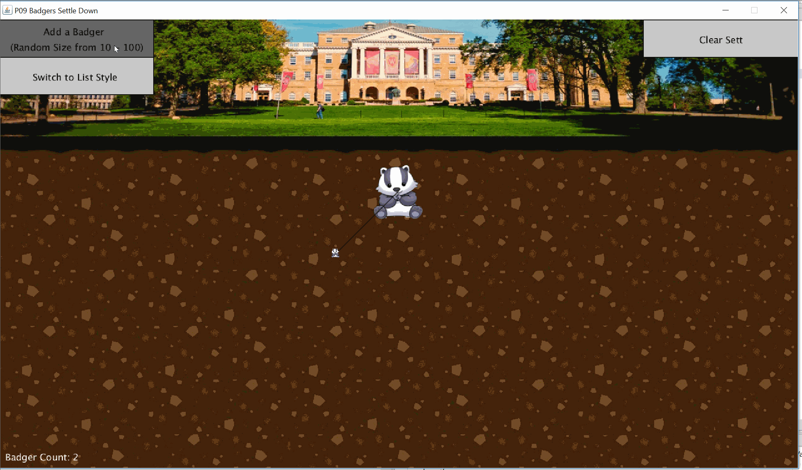

# BADGERS-SETTLE-DOWN

**BADGERS SETTLE DOWN** is an project assignment at UW-Madison CS300 course to help understand and conceptualize the idea of Binary Search Tree. In this assignment we will help badgers settle down into a sett.  Since larger badgers have an easier time staying warm in the winter, we’ve decided to organize them into the northern right-most rooms within the sett.  And smaller badgers will be in the southern left-most rooms.  To help manage this, we will be using a Binary Search Tree (BST) organization that is ordered by the badgers’ size.  Below are some screenshots of the provided visualizer to help check the functionality of the Badger BST.

Author: **[Ajmain Naqib](mailto:naqib@wisc.edu)**
Course: CS300, Fall 2018
Lecturer's Name: Gary Dahl
Time spent: **6.7** hours spent in total

## Project Introduction

Winter is coming!  To withstand the great cold, badgers plan to settle down in our beautiful campus.  Clever as badgers are, they have no idea how to keep warm with limited space.  You decide to help these cute badgers, by arranging them into a Binary Search Tree within the sett.

More information about this project can be found [here.](http://cs300-www.cs.wisc.edu/wp/index.php/2018/11/14/p09-badgers-settle-down/) 

The following **required** functionality is completed:

* [X] Badger class that contain's information of **size and nearby badgers.**
* [X] Sett class **arranges all the badger's** in a BST
* [X] Base and Recursive methods to **count total number of nodes** in BST.

## Video Walkthrough

Here's a walkthrough of implemented functionality:

GIF created with [LiceCap](http://www.cockos.com/licecap/).

## Notes

- A lot of the error handling for this project didn't make sense to me. Should have been handled better.

## License

    Copyright [2018] [Ajmain Naqib]

